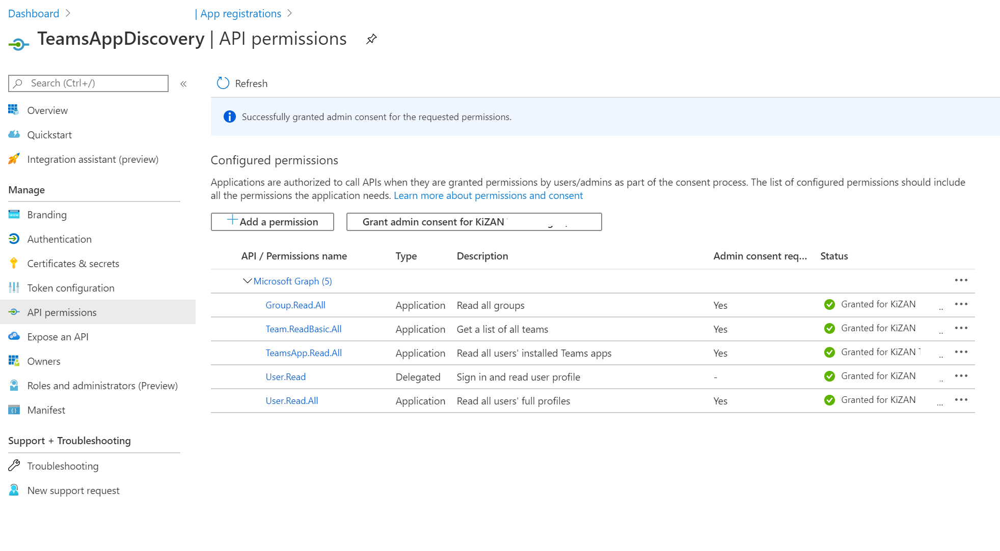

# Teams App Discovery Script

Discover all of the Apps added to Teams in your organization, both in Teams Channels as well as user-installed Apps.

## Permissions

Below are the current required permissions for this discovery script at the Application level, and granted admin consent for the organization.

- Team.ReadBasic.All
- TeamsApp.Read.All
- Group.Read.All
- User.Read.All

Once you create the application and grant the permissions, it should look like the below:

Configure a client application secret, and copy the values into the header of the script.

## Pending Updates/Improvements

Items pending development.

- Output formatting and/or pushing of data to more "reportable" locations
